<!-- 由 剪切信号处理及钢卷坐标变化情况设计方案-20251226.docx 转换生成；复杂版式已尽量转为图片保留。 -->

#### 剪切信号处理

| 剪刀种类 | 数据来源 | 场景 |
| --- | --- | --- |
| 入口剪 | 1.开卷机原料卷号 2.卷取机原料卷号 3.入口剪到开卷机光栅占位信号 4.开卷机剩余钢卷长度 5.剪切长度设定值 6.切尾量经验值 7.最大分切切废量经验值 | 1.**切头：** 开卷机原料卷号≠卷取机原料卷号&&入口剪到开卷机光栅连续占位 切尾： 1.开卷机原料卷号=卷取机原料卷号&&开卷机剩余钢卷长度<切尾量经验值 2.开卷机原料卷号≠卷取机原料卷号&&入口剪到开卷机光栅不连续占位 分切： 开卷机原料卷号=卷取机原料卷号&&开卷机剩余钢卷长度>=切尾量经验值 |
| 出口剪 | 1.开卷机原料卷号 2.卷取机原料卷号 3.出口剪到卷取机光栅占位信号 4.剪切长度设定值 5.最大分切切废量经验值 | **切头：** 开卷机原料卷号≠卷取机原料卷号&&出口剪到卷取机光栅非连续占位 切尾： 开卷机原料卷号≠卷取机原料卷号&&出口剪到卷取机光栅连续占位 分切： 开卷机原料卷号=卷取机原料卷号 |
| 入口双层剪 | 1.开卷机钢卷颜色 2.卷取机钢卷颜色 3.剪刀靠近开卷机侧颜色 4.开卷机剩余钢卷长度 5.剪切长度设定值 6.切尾量经验值 7.最大分切切废量经验值 | **切头：** 开卷机钢卷颜色≠卷取机钢卷颜色&&剪刀靠近开卷机侧颜色=开卷机钢卷颜色 切尾： 1.开卷机钢卷颜色=卷取机钢卷颜色&&开卷机剩余钢卷长度<=切尾量经验值 2.开卷机钢卷颜色≠卷取机钢卷颜色&&剪刀靠近开卷机侧颜色≠开卷机钢卷颜色 分切： 开卷机钢卷颜色=卷取机钢卷颜色&&开卷机剩余钢卷长度>切尾量经验值 |
| 出口飞剪 | 1.卷取机处颜色 2.活套处颜色 3.后取样片数 4.后废料片数 5.焊缝废料片数 6.单片剪切长度 7.最大分切切废量经验值 | **切焊缝：**既切头又切尾 分切：卷取机处颜色=活套处颜色 |
| 圆盘剪 | 1.开卷机钢卷宽 2.圆盘剪设定宽度 | **边部剪切** |

##### 非连续处理线入口剪触发信号

**切头：**开卷机原料卷号≠卷取机原料卷号&&入口剪到开卷机光栅连续占位

**记录数据：**开卷机原料卷切头量+=入口剪剪切长度设定值

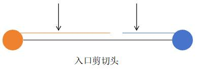

**切尾：**

2.开卷机原料卷号=卷取机原料卷号&&开卷机剩余钢卷长度<切尾量经验值

**记录数据：**卷取机原料卷号切尾量+=入口剪剪切长度设定值

3.开卷机原料卷号≠卷取机原料卷号&&入口剪到开卷机光栅不连续占位

**记录数据：**卷取机原料卷切尾量+=入口剪剪切长度设定值

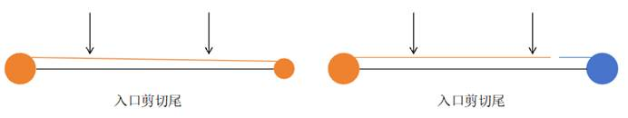

**分切：**开卷机原料卷号=卷取机原料卷号&&开卷机剩余钢卷长度>=切尾量经验值

**记录数据：**半卷回退。

1.记录原始原料卷号的切头量、切尾量，以及每个子卷后的切废量，切废量记为原料卷号#1切废、原料卷号#2切废、原料卷号#3切废

2.识别到分切信号时，查询当前原料卷的#切废最大值，原料卷#MAX切废

2.1若未查询到，则生成原料卷号#1，其切废量=0，其开卷机剩余长度=当前开卷机剩余长度

2.2若查询到，则判断 原料卷#MAX切废的开卷机剩余长度-当前开卷机剩余长度<=最大切废量

2.2.1若判断结果为真，则说明该信号为上一次分切行为中的切废。原料卷#MAX切废的切废量+=出口剪剪切长度设定值

2.2.2若判断结果为假，则说明该信号为下一次分切行为。生成原料卷#MAX+1切废，其切废量=0，其开卷机剩余长度=当前开卷机剩余长度

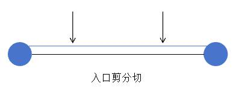

##### 非连续处理线出口剪触发信号

**切头：**开卷机原料卷号≠卷取机原料卷号&&出口剪到卷取机光栅非连续占位

**记录数据：**开卷机原料卷切头量+=出口剪剪切长度设定值

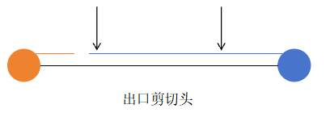

**切尾：**开卷机原料卷号≠卷取机原料卷号&&出口剪到卷取机光栅连续占位

**记录数据：**卷取机原料卷号切尾量+=出口剪剪切长度设定值

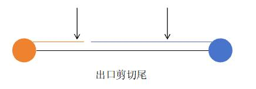

**分切：**开卷机原料卷号=卷取机原料卷号

**记录数据：**

1.记录原始原料卷号的切头量、切尾量，以及每个子卷后的切废量，切废量记为原料卷号#1切废、原料卷号#2切废、原料卷号#3切废

2.识别到分切信号时，查询当前原料卷的#切废最大值，原料卷#MAX切废

2.1若未查询到，则生成原料卷号#1，其切废量=0，其开卷机剩余长度=当前开卷机剩余长度

2.2若查询到，则判断 原料卷#MAX切废的开卷机剩余长度-当前开卷机剩余长度<=最大切废量

2.2.1若判断结果为真，则说明该信号为上一次分切行为中的切废。原料卷#MAX切废的切废量+=出口剪剪切长度设定值

2.2.2若判断结果为假，则说明该信号为下一次分切行为。生成原料卷#MAX+1切废，其切废量=0，其开卷机剩余长度=当前开卷机剩余长度

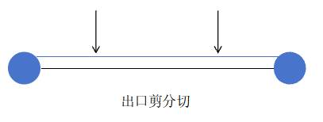

##### 连续处理线入口双层剪触发信号

**切头：**开卷机钢卷颜色≠卷取机钢卷颜色&&剪刀靠近开卷机侧颜色=开卷机钢卷颜色

**记录数据：**根据开卷机钢卷颜色获取原料卷号，该原料卷号切头量+=入口剪剪切长度设定值

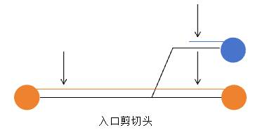

**切尾：**

1.开卷机钢卷颜色=卷取机钢卷颜色&&开卷机剩余钢卷长度<=切尾量经验值

**记录数据：**根据卷取机钢卷颜色获取原料卷号，该原料卷号切尾量+=入口剪剪切长度设定值

2.开卷机钢卷颜色≠卷取机钢卷颜色&&剪刀靠近开卷机侧颜色≠开卷机钢卷颜色

**记录数据：**根据卷取机钢卷颜色获取原料卷号，该原料卷号切尾量+=入口剪剪切长度设定值

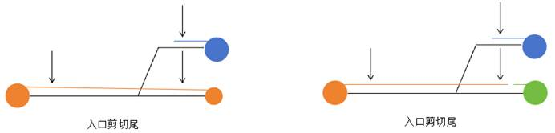

**分切：**开卷机钢卷颜色=卷取机钢卷颜色&&开卷机剩余钢卷长度>切尾量经验值

**记录数据：**半卷回退。

1.记录原始原料卷号的切头量、切尾量，以及每个子卷后的切废量，切废量记为原料卷号#1切废、原料卷号#2切废、原料卷号#3切废

2.识别到分切信号时，查询当前原料卷的#切废最大值，原料卷#MAX切废

2.1若未查询到，则生成原料卷号#1，其切废量=0，其开卷机剩余长度=当前开卷机剩余长度

2.2若查询到，则判断 原料卷#MAX切废的开卷机剩余长度-当前开卷机剩余长度<=最大切废量

2.2.1若判断结果为真，则说明该信号为上一次分切行为中的切废。原料卷#MAX切废的切废量+=出口剪剪切长度设定值

2.2.2若判断结果为假，则说明该信号为下一次分切行为。生成原料卷#MAX+1切废，其切废量=0，其开卷机剩余长度=当前开卷机剩余长度

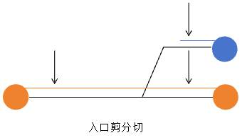

##### 连续处理线飞剪触发信号

**切焊缝：**既切头又切尾

**记录数据：**取活套处颜色号对应原料卷号，切头量=（后取样片数+后废料片数+焊缝废料片数/2）x单片剪切长度；取卷取机处颜色号对应原料卷号，切尾量=（前取样片数+前废料片数+焊缝废料片数/2）x单片剪切长度

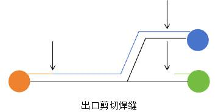

**分切：**卷取机处颜色=活套处颜色

**记录数据：**

1.记录原始原料卷号的切头量、切尾量，以及每个子卷后的切废量，切废量记为原料卷号#1切废、原料卷号#2切废、原料卷号#3切废

2.识别到分切信号时，查询当前原料卷的#切废最大值，原料卷#MAX切废

2.1若未查询到，则生成原料卷号#1，其切废量=0，其开卷机剩余长度=当前开卷机剩余长度

2.2若查询到，则判断 原料卷#MAX切废的开卷机剩余长度-当前开卷机剩余长度<=最大切废量

2.2.1若判断结果为真，则说明该信号为上一次分切行为中的切废。原料卷#MAX切废的切废量+=飞剪剪切长度设定值

2.2.2若判断结果为假，则说明该信号为下一次分切行为。生成原料卷#MAX+1切废，其切废量=0，其开卷机剩余长度=当前开卷机剩余长度

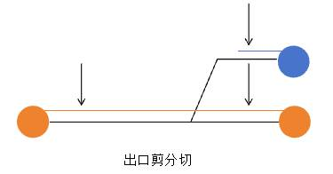

##### 圆盘剪信号

**边部剪切**

**记录数据：**切边量=（开卷机钢卷宽度-圆盘剪设定宽度）/2

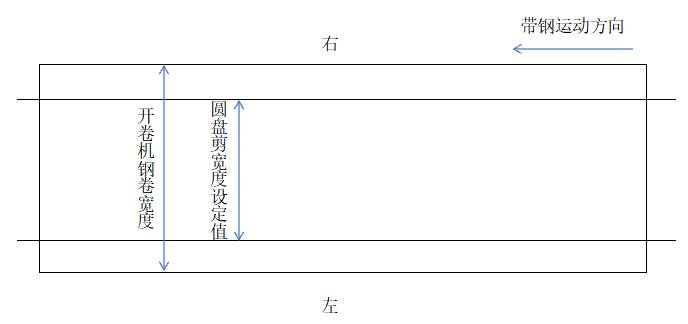

#### 钢卷坐标位置变化

**钢卷坐标系定义：**对于任意一个钢卷，经过翻转后，使其带头出现在钢卷的最上方，定义其带头朝外的一侧为头，卷在钢卷内部的一侧为尾，带头的上表面为上，带头的下表面为下，带头的左侧为左，右侧为右。

**钢卷过程数据坐标系定义：**运行中的带钢，最先从开卷机中开出来的为头部，最后从开卷机中出来的为尾部，运行中的带钢的上表面为上，下表面为下，带钢运行方向的左侧为左，右侧为右

**工序内部钢卷坐标变化情况：**

工序内部坐标变化情况，0表示一致，1表示不一致，0表示一致，1表示不一致

| 表一：钢卷过程数据相对原料卷的坐标变化 |   |   |   |
| --- | --- | --- | --- |
| 开卷方式 | 上下 | 左右 | 头尾 |
| 上开卷 | 0 | 0 | 0 |
| 下开卷 | 1 | 1 | 0 |

| 表二：成品数字钢卷相对钢卷过程数据的坐标变化 |   |   |   |
| --- | --- | --- | --- |
| 卷取方式 | 上下 | 左右 | 头尾 |
| 上卷取 | 0 | 1 | 1 |
| 下卷取 | 1 | 0 | 1 |

| 表三：成品数字钢卷相对原料卷的坐标变化（由表一表二叠加得到） |   |   |   |   |
| --- | --- | --- | --- | --- |
| 开卷方式 | 卷取方式 | 上下 | 左右 | 头尾 |
| 上开卷 | 上卷取 | 0 | 1 | 1 |
| 上开卷 | 下卷取 | 1 | 0 | 1 |
| 下开卷 | 上卷取 | 1 | 0 | 1 |
| 下开卷 | 下卷取 | 0 | 1 | 1 |

以下开卷，上卷取为例：

1.已知，钢卷过程数据：上表面，距离头1m，距离左侧6m处有瑕疵

2.由钢卷过程数据根据表一可推得，原料钢卷：下表面，距离头1m，距离右侧6m处有瑕疵

3.由钢卷过程数据根据表二可推得，成品数字钢卷：上表面，距离尾1m，距离右侧6m处有瑕疵

若计算某工序的成品数字钢卷相对于首工序的原料卷（进冷轧厂的原始卷）的坐标变化，需要将某工序及之前所有工序的表三结果进行叠加
