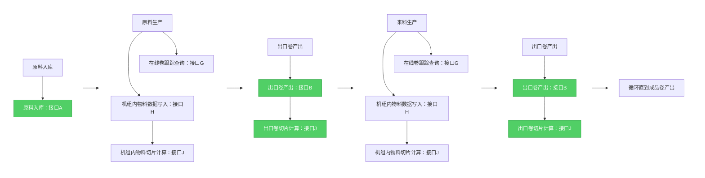
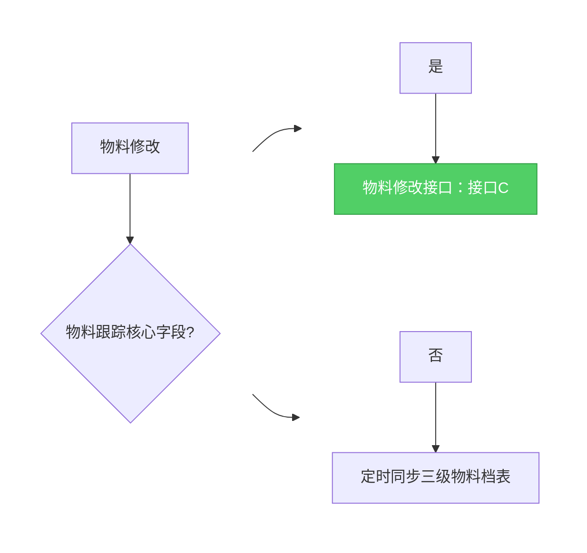
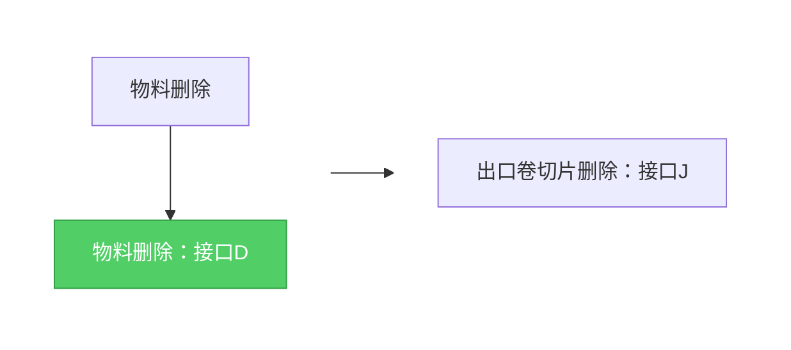
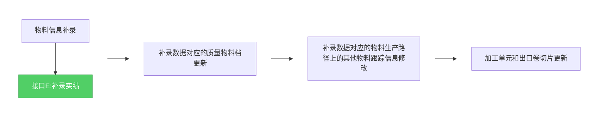

## 沟通方案

物料预处理：

原料入库：三级触发接口，质量主物料档表生成一条数据，生产次数为0，生成质量主物料档表中物料跟踪号，需要三级物料跟踪号的

在线卷跟踪：跟踪服务根据机组代码+入口物料号查询质量主物料档表中出口物料号对应的质量物料跟踪号和最大生产次数号，跟踪服务将生产次数号加1，作为入口物料生产次数号。多加工单元的情况：写入加工单元代码

在线卷多加工单元：机组内生产完一个加工单元后，调用接口质量机组内物料关系表生成一条数据，写入加工单元代码，触发出口卷切片G。如：单机架轧机：每个道次生产完后触发，加工单元代码写入道次号。参照二级每个道次产出的数据：材料号、宽度、厚度、长度的逻辑。

出口卷：

（1）物料档处理：三级物料档产出触发接口F，质量主物料案表生成一条数据、机组间物料关系表生成对应数据、机组内物料关系表。判断是否同一物料得加上逻辑判断：上机组出口材料号 = 下机组入口材料号

（2）机组内物料关系表写完一条数据调用出口卷切片接口：

物料操作影响表：

| 物料操作         | 具体描述                                                     |
| ---------------- | ------------------------------------------------------------ |
| 原料入库         | 触发原料入库接口A                                            |
| 出口卷产出       | 各机组钢卷正常下线：触发出口卷产出接口B 常化先切边后常化的情况：二次都触发出口卷产出接口B，切边和常化两次生产入口材料号A和出口材料号B不变，需要特殊处理 分卷：出口材料号倒数第二位不为0时标识为分卷顺序号 并卷：入口材料号in_mat_no内多个数据，用','分隔 |
| 物料实绩信息修改 | 触发修改实绩信息接口C，有修改入口材料号和出口材料号情况      |
| 物料实绩信息删除 | 触发删除实绩接口D（逻辑删除），影响生产路径的追溯            |
| 轧机断带异常     | 产出子卷与出口卷产出一样                                     |
| 补录             | 补录与出口卷产出一样，**生产路径追溯会受到影响。举例：物料实际生产路径常化-准备-轧机- D线，D线产出实绩后轧机才补录实绩，因为D线的入口材料号与准备机组的出口材料号不一致，导致D线开始是新的跟踪号。这个情况不存在**。方案：触发补录实绩接口E。 |
| 返修             | 返修与出口卷产出一样，不影响生产次数号的处理                 |
| 半卷回退         | 1.正常产出卷与出口卷产出一样  2. 回退实绩出口材料号变、跟踪号和入口材料号不变，质量物料档表不需要同步 |

质量物料档表与三级数据表的对应关系表：（标粗部分为物料跟踪核心字段）

| 名称             | 字段名                | 来源         | 字段名                  | 备注                               |
| ---------------- | --------------------- | ------------ | ----------------------- | ---------------------------------- |
| **机组代码**     | unit_code             | 三级实绩表   | unit_code               |                                    |
| **物料跟踪号**   | mat_track_no          | 三级实绩表   | mat_track_no            | 质量物料档表中跟踪号逻辑会重新生成 |
| **出口材料号**   | out_mat_no            | 三级实绩表   | out_mat_no              |                                    |
| **入口材料号**   | in_mat_no             | 三级实绩表   | in_mat_no               |                                    |
| 生产时刻         | prod_time             | 三级实绩表   | end_prod_time           |                                    |
| 初始牌号(钢级)   | initial_sg_sign       | 三级实绩表   | sg_sign                 | 内部牌号                           |
| 出口长度m        | out_mat_length        | 三级实绩表   | out_mat_len             |                                    |
| 出口厚度mm       | out_mat_thick         | 三级实绩表   | out_mat_thick           |                                    |
| 出口宽度mm       | out_mat_width         | 三级实绩表   | out_mat_width           |                                    |
| 出口重量kg       | out_mat_wt            | 三级实绩表   | out_mat_act_wt          |                                    |
| 生产班次         | prod_shift_no         | 三级实绩表   | prod_shift_no           |                                    |
| 生产班组         | prod_shift_no         | 三级实绩表   | prod_shift_group        |                                    |
| 炉台号           | baf_no                | 三级实绩表   | baf_no                  |                                    |
| 炉台方向         | hearth_direction      | 三级实绩表   | hearth_direction        | 南北侧                             |
| 速度             | speed                 | 三级实绩表   | speed                   |                                    |
| 三级物料档id     | mes_id                | 三级物料档表 | id                      |                                    |
| 工序代码         | backlog_code          | 三级物料档表 | whole_backlog_code      |                                    |
| 下道工序代码     | next_backlog_code     | 三级物料档表 | next_whole_backlog_code |                                    |
| 物料种类         | mat_kind              | 三级物料档表 | mat_kind                | 生产结束时间                       |
| 成品牌号（钢级） | sg_sign               | 三级物料档表 | sg_sign                 | 判级时候会变                       |
| 成品标记         | product_flag          | 三级物料档表 | product_flag            |                                    |
| 材料状态         | mat_status            | 三级物料档表 | mat_status              |                                    |
| **切边标记**     | trim_flag             | 三级物料档表 | trim_flag               |                                    |
| 材料库位号       | stock_place_no        | 三级物料档表 | stock_place_no          |                                    |
| 封锁注释         | hold_remark           | 三级物料档表 | hold_remark             |                                    |
| 产品等级码       | prod_level_code       | 三级物料档表 | prod_level_code         |                                    |
| 降级注释         | drop_level_remark     | 三级物料档表 | drop_level_remark       |                                    |
| 余材注释         | remain_remark         | 三级物料档表 | remain_remark           |                                    |
| 缺陷代码         | defect_code           | 三级物料档表 | defect_code             |                                    |
| 缺陷等级         | defect_class          | 三级物料档表 | defect_class            |                                    |
| 缺陷注释         | surface_decide_remark | 三级物料档表 | surface_decide_remark   | 表面判定注释                       |

沟通问题：

1、物料流转

**旧方案**：质量物料档定时5分钟通过update_time扫三级物料档表同步更新数据，每小时全量同步删除的数据

**周一沟通接口触发方案**：三级物料档的事件触发来源众多，事件触发（判定、发货）全部更改，工作量大，耦合度太高，维护风险高。

**新方案**：

​	1、物料处理、切片处理：所需物料跟踪核心字段-机组代码、跟踪号、入口物料号、出口物料号、生产结束时间。事件触发收敛到实绩管理、补录管理、返修管理，完成增删改触发。

​	2、非核心字段的同步：质量物料档定时通过update_time扫三级物料档表更新对应数据，得考虑新加质量更新标识（针对所需字段梳理），现阶段update_time因库管数据同步每5分钟数据量大。凌晨0点做一次全量同步。

​	3、检测参数指标计算和过程质量判定：定时扫质量物料档表满不满足条件，满足条件就计算，不满足就跳过，关联的因素是需要三级物料档字段的，比如：产品等级码、缺陷代码。

2、三级物料档的update_time是否真实触发，针对所提的相关字段，没有问题。

三级物料与质量物料档

1、接口内容

2、接口调用时机

3、异常补录场景：数据流转明细、生产路径变化

还要考虑批处理/初始化：物料档里面不存在已经过了常化的切边实绩数据，需要先从切边实绩表中同步所有数据、再从物料档同步常化及后工序所有数据（trim_flag=0的数据）

剩余问题：

1、接口日志管理

---

## 场景流程图

### 场景一：正常产出

 

### 场景二：物料修改

### 场景三：物料删除

### 场景四：物料补录（不需要）

### 场景五：指标计算&质量判定

定时任务：按生产时间获取最近5分钟数据，判断指标计算和判定条件满不满足（物料的），满足条件就触发计算和判定，不满足就不触发。

手动触发：交互入口层面的需要重新整理

两种方式都是重算，将之前的存储的计算和判定结果删除然后重新计算和判定

---

## 接口定义

### 接口A：原料入库接口

| 项目     | 说明                                                         |
| -------- | ------------------------------------------------------------ |
| **逻辑** | 质量主物料档表生成一条数据，生产次数为0，质量主物料档跟踪号生成逻辑：“MT”+时间戳+随机数 |

### 接口B：出口卷产出接口

|          | 说明                                                         |
| -------- | ------------------------------------------------------------ |
| **逻辑** | 1、质量物料档表跟踪号变换逻辑：分卷/并卷情况下，生成新的跟踪号，生产次数为1；非分卷/并卷情况下，跟踪号不变，生产次数+1 2、物料生产流转逻辑：上机组的出口物料号 in 下机组的入口材料号，并卷情况下入口材料号数据由多个，用","分隔，分隔顺序标识并卷顺序号 3、分卷逻辑：出口材料号的倒数第二位不为0，且为分卷顺序号 4、并卷逻辑：入口材料号数据由多个，用","分隔，分隔顺序标识并卷顺序号 5、重复生产逻辑：机组代码、入口材料号、出口材料号都相同，则为重复生产，生产次数号+1。机组间和机组内物料关系表中入口物料跟踪信息（跟踪号+生产次数号）对应本机组内上一次生产的出口物料跟踪信息，但材料号不变 6、同时写入三个表的数据：质量主物料档表、机组间物料关系表、机组内物料关系表（逻辑：加工单元代码要判断对应的） 7、机组内物料关系表数据写入后，调用出口卷切片计算接口 |

### 接口C：物料修改接口

| 项目     | 说明                                                         |
| -------- | ------------------------------------------------------------ |
| **逻辑** | 1、同时修改三个表的数据：质量主物料档表、机组间物料关系表、机组内物料关系表 |

### 接口D：物料删除接口

| 项目     | 说明                                                         |
| -------- | ------------------------------------------------------------ |
| **逻辑** | 1、同时逻辑删除三个表的数据：质量主物料档表、机组间物料关系表、机组内物料关系表。 2、多加工单元情况机组内物料关系表该物料的所有加工单元数据全部逻辑删除 3、机组内物料关系表数据删除后，调用出口卷切片删除接口J，多个加工单元切片数据全部删除 4、机组代码、跟踪号，入口材料号无法修改 5、出口材料号可以修改，但必须在本机组内完成修改，下道机组生产后是不允许修改的 |

### 接口E：补录实绩接口（不需要）

| 项目 | 说明 |
|------|------|
| **接口编码** | E |
| **描述** | 补录实绩时触发，修正生产路径追溯，重新计算机组间物料关系 |
| **URL** | `POST /api/quality/material/supplement` |
| **逻辑** | 本来认为生产路径追溯会受到影响。举例：物料实际生产路径常化-准备-轧机- D线，D线产出实绩后轧机才补录实绩，因为D线的入口材料号与准备机组的出口材料号不一致，导致D线开始是新的跟踪号。但这个情况不存在 |

**入参**：
| 参数 | 类型 | 必填 | 说明 |
|------|------|------|------|
| unitCode | String | 是 | 机组代码 |
| inMatNo | String | 是 | 入口材料号 |
| outMatNo | String | 是 | 出口材料号 |
| prodTime | DateTime | 是 | 生产结束时间 |
| originalOrder | Integer | 否 | 原始补录顺序 |
| sgSign | String | 否 | 初始牌号 |
| outMatLen | Decimal | 否 | 出口长度 |
| outMatThick | Decimal | 否 | 出口厚度 |
| outMatWidth | Decimal | 否 | 出口宽度 |
| outMatActWt | Decimal | 否 | 出口重量 |
| prodShiftNo | String | 否 | 生产班次 |
| prodShiftGroup | String | 否 | 生产班组 |

**出参**：
| 参数 | 类型 | 说明 |
|------|------|------|
| code | Integer | 状态码，200成功 |
| message | String | 提示信 |

### 接口F：非核心字段的三级物料档表与质量物料档表对表同步接口 

| 项目         | 说明                                                         |
| ------------ | ------------------------------------------------------------ |
| **接口编码** | F                                                            |
| **描述**     | 非核心字段像生产班次、班组、缺陷代码等字段定时扫表同步       |
| **URL**      | `POST /api/quality/material/sync`                            |
| **逻辑处理** | 1、根据update_time定时扫描最近5分钟的三级物料档表数据，然后基于三级物料档ID更新质量物料档三个表的数据：质量主物料档表、机组间物料关系表、机组内物料关系表 2、每天0点定时全量数据同步 |

**入参**：

| 参数     | 类型   | 必填 | 说明       |
| -------- | ------ | ---- | ---------- |
| unitCode | String | 否   | 机组代码   |
| inMatNo  | String | 否   | 入口材料号 |

**出参**：

| 参数            | 类型    | 说明            |
| --------------- | ------- | --------------- |
| code            | Integer | 状态码，200成功 |
| message         | String  | 提示信息        |
| data            | Class   | 对象            |
| data.matTrackNo | String  | 入口物料跟踪号  |
| data.matProdNo  | Integer | 生产次数号      |

描述：非核心字段的同步

触发：一个根据update_time最近5分钟；每天0点全量同步

### 接口G：在线卷跟踪查询接口

| 项目         | 说明                                                         |
| ------------ | ------------------------------------------------------------ |
| **接口编码** | G                                                            |
| **描述**     | 在线卷跟踪前触发接口获取入口物料跟踪号和生产次数号           |
| **URL**      | `POST /api/quality/material/online-coil-tracking`            |
| **逻辑处理** | 跟踪服务根据机组代码+入口物料号查询质量主物料档表中出口物料号对应的质量物料跟踪号和最大生产次数号，跟踪服务将生产次数号加1，作为入口物料生产次数号 |

**入参**：

| 参数    | 类型   | 必填 | 说明       |
| --------- | ------ | ---- | ---------- |
| unitCode | String | 否   | 机组代码   |
| inMatNo  | String | 否   | 入口材料号 |

**出参**：

| 参数              | 类型    | 说明            |
| ----------------- | ------- | --------------- |
| code              | Integer | 状态码，200成功 |
| message           | String  | 提示信息        |
| data              | Class   | 对象            |
| data.inMatTrackNo | String  | 入口物料跟踪号  |
| data.matProdNo    | Integer | 生产次数号      |

### 接口H：单机架轧机机组内物料数据写入接口 

| 项目         | 说明                                                         |
| ------------ | ------------------------------------------------------------ |
| **接口编码** | H                                                            |
| **描述**     | 仅针对单机架轧机，多加工单元机组生产时，每个道次切换后触发   |
| **URL**      | `POST /api/quality/material/cell-blood/output`               |
| **逻辑处理** | 1、单机架轧机跟踪服务调用该接口写入数据。宽度参数跟踪服务是不知道的，由接口内获取机组间入口物料对应的宽度、钢种参数后写入，关系类型为正常0，出口物料顺序号为1 2、调用出口卷切片计算接口 3、加工单元代码定义：机组代码+00N. |

**入参**：

| 参数              | 类型    | 必填 | 说明               |
|-------------------| ------- | ---- | ------------------ |
| unitCode          | String  | 是   | 机组代码           |
| inMatNo           | String  | 是   | 入口物料跟踪号     |
| inMatRepeatProdNo | String  | 是   | 入口物料生产次数号 |
| cellCode          | String  | 是   | 加工单元代码       |
| startProdTime     | String  | 是   | 生产开始时间       |
| endProdTime       | String  | 是   | 生产结束时间       |
| outMatThick       | Numeric | 是   | 出口厚度mm         |
| outMatLength      | Numeric | 是   | 出口长度m          |

**出参**：

| 参数    | 类型    | 说明            |
| ------- | ------- | --------------- |
| code    | Integer | 状态码，200成功 |
| message | String  | 提示信息        |

### 接口I：批处理三级物料档同步接口

| 项目         | 说明                                                         |
| ------------ | ------------------------------------------------------------ |
| **接口编码** | I                                                            |
| **描述**     | 系统初始化或是接口出问题，批处理一段时间范围内的三级物料档数据 |
| **URL**      | `POST /api/quality/material/batch`                           |
| **逻辑处理** | 1、根据create_time先扫描三级切边实绩表同步完成后再扫描三级物料档表同步 2、根据三级物料档中跟踪号和入口材料号数据，写入或更新质量物料档三个表的数据：质量主物料档表、机组间物料关系表、机组内物料关系表 3、**切片是否优化作为优化项** |

**入参**：

| 参数       | 类型   | 必填 | 说明                   |
| ------------ | ------ | ---- | ---------------------- |
| startTime | String | 是  | 开始时间         |
| endTime | String | 是   | 结束时间     |

**出参**：

| 参数    | 类型    | 说明            |
| ------- | ------- | --------------- |
| code    | Integer | 状态码，200成功 |
| message | String  | 提示信息        |

### 接口J：出口卷切片计算接口

| 项目         | 说明                                                         |
| ------------ | ------------------------------------------------------------ |
| **接口编码** | J                                                            |
| **描述**     | 出口卷产出或是加工单元实绩产出后，触发切片计算               |
| **URL**      | `POST /api/quality/piece/output`                             |
| **逻辑处理** | 1、机组内的物料关系表数据写入后调用 2、切片长度配置到数字工厂机组的属性里面 |

**入参**：

| 参数          | 类型   | 必填 | 说明               |
| ------------- | ------ | ---- | ------------------ |
| unitCode      | String | 是   | 机组代码           |
| outMatTrackNo | String | 是   | 出口物料跟踪号     |
| outMatProdNo  | String | 是   | 出口物料生产次数号 |
| cellCode      | String | 是   | 加工单元代码       |
| pieceLength   | String | 是   | 切片长度           |

**出参**：

| 参数    | 类型    | 说明            |
| ------- | ------- | --------------- |
| code    | Integer | 状态码，200成功 |
| message | String  | 提示信息        |

### 接口K：出口卷切片删除接口

| 项目         | 说明                                   |
| ------------ | -------------------------------------- |
| **接口编码** | K                                      |
| **描述**     | 质量物料档数据删除时，切片数据对应删除 |
| **URL**      | `POST /api/quality/piece/delete`       |
| **逻辑处理** | 机组内的物料关系表数据写入后调用       |

**入参**：

| 参数          | 类型   | 必填 | 说明               |
| ------------- | ------ | ---- | ------------------ |
| unitCode      | String | 是   | 机组代码           |
| outMatTrackNo | String | 是   | 出口物料跟踪号     |
| outMatProdNo  | String | 是   | 出口物料生产次数号 |
| cellCode      | String | 是   | 加工单元代码       |

**出参**：

| 参数    | 类型    | 说明            |
| ------- | ------- | --------------- |
| code    | Integer | 状态码，200成功 |
| message | String  | 提示信息        |

## 业务功能

物料追溯接口：指标追溯结构树、曲线追溯结构树、数字钢卷档案导航栏接口、切片跨工序对齐接口。2d

指标追溯查询接口：校验一下0,.5

指标计算接口：针对切片数据计算 1d

SPC检测参数指标值：校验一下

钢卷档案：剪切跟踪放到左下角；

分段质量分布：1、上下都可以加入标尺：2、右上角解释重写：3、标尺固定，坐标轴数值用三角表示 4、提供设定值，用于判断异常偏差值情况

曲线追溯、钢卷档案曲线追溯数据源切换为切片

SPC的实时值数据源切换为切片

扩展优化

指标计算的配置和计算

质量判定
