<!-- 由 数字钢卷构建方案.docx 转换生成；复杂版式已尽量转为图片保留。 -->

# 数字钢卷构建方案

术语解释及注意点

**车间：**炼钢车间，冷轧车间。

**工序：**酸洗工序，轧机工序，连退工序。

**机组：**1#酸洗机组，2#酸洗机组，1#轧机机组，2#轧机机组，**单机架轧机，连轧机，酸轧**。

**加工单元：**单机架轧机多个道次算多个加工单元。连轧机多个机架算多个加工单元。酸轧中酸洗算1个加工单元，轧机算1个加工单元。

**切片：**对钢卷在长度维度上进行离散化所形成的同钢卷等长跟踪单元。

**原始卷：**进入冷轧车间用于首次生产的钢卷。

**入口卷：**进入加工单元的钢卷。

**在线卷：**在加工单元生产的钢卷。

**出口卷：**加工单元产出后的钢卷。

**厚度比值**：出口卷厚度/入口卷厚度。

**在线卷过程跟踪数据**：钢卷生产时按时间及长度维度采集工艺参数的时序记录。

**带头长度**：钢卷带头通过加工单元起点位置（第一个焊缝检测仪）的长度，负值表示入口穿带过程中带头与焊机的距离。

**出口卷切片**：不同加工单元设定各自的切片长度，在各加工单元内按设定切片长度对出口卷进行划片。

**出口卷切片数据**：每个切片记录其工艺数据与缺陷数据，只记录本加工单元数据，不包含前机组和加工单元的数据。

**跨加工单元对齐切片数据：**各加工单元完成后，以某长度值（如1m）作为最后一个加工单元的切片基准，因延伸对所有加工单元重新划片，保证各加工单元切片一一对应。

**机组间物料血缘关系数据**：物料跨不同机组流转的对应关系。

**加工单元间物料血缘关系数据**：物料在同一机组内不同加工单元间的对应关系。

# 1数字钢卷应包含的数据与信息

| **模块** | **数据内容** | **描述** |
| --- | --- | --- |
| 基础标识数据 | 唯一标识数据 | 钢卷编号（条码/RFID/二维码关联）、订单号、批次号、炉批号等 |
| 基础属性 | 钢种、规格参数（厚宽长、理论/实际重量、外径/内径）等 |   |
| 归属属性 | 钢厂名称、生产基地、车间编号、合同号、交货方/收货方等 |   |
| 质量检测数据 | 检化验类数据 | 物理性能检测数据、化学成分检测数据、检化验结果及判定数据 |
| 外观与表面缺陷数据 | 缺陷类型（划痕/裂纹等）、位置坐标、大小/数量、判定数据 |   |
| 尺寸精度检测数据 | 厚度、宽度、板型及判定数据 |   |
| 过程质量数据 | 在线的性能检测数据及判定数据 |   |
| 质量标准数据 | 产品质量标准 | 执行标准号、产品品类标准 |
| 检验质量标准 | 取样要求、力学性能目标值及公差、化学成分目标值及公差等 |   |
| 精度质量标准 | 尺寸公差（厚度 ±0.02mm等）、板形偏差限值等 |   |
| 订单质量要求 | 定制化需求（涂层厚度、粗糙度Ra≤0.8μm）、合规认证要求等 |   |
| 表面和外观标准 | 表面和外观的质量要求 |   |
| 工艺控制标准 | 各生产工序的工艺控制标准、工艺质量判定标准 |   |
| 生产过程数据 | 生产节拍数据 | 工序生产的节拍数据 |
| 工艺数据 | 焊接工艺、轧制工艺、炉温工艺、酸洗工艺等数据 |   |
| 生产剪切数据 | 切头、切尾、切边等剪切数据 |   |
| 消耗数据 | 原材料消耗数据 | 原料重量、原料规格、原料钢种等数据 |
| 辅料消耗数据 | 轧制油/防锈油用量、包装材料消耗量、清洗剂/钝化剂用量等 |   |
| 备件消耗数据 | 轧辊磨损量、刀具/模具损耗情况（关联钢卷批次）等 |   |
| 能源消耗数据 | 各能介的消耗原始值、核算值等数据 |   |
| 物流仓储数据 | 仓储信息 | 入库时间、库位编号、库存状态（在库/在途等）等 |
| 运输信息 | 运输车辆编号、起运/到达时间、运输路线、装卸记录等 |   |
| 包装信息 | 包装方式（防潮/防锈）、捆扎道数、防护措施、包装完成时间 |   |
| 生产管理数据 | 人员信息 | 各工序操作人员编号、检验人员编号、班组长编号、班组信息等 |
| 生产管理信息 | 质量处置数据（降等、封锁、改配等）、返修数据、物料状态 |   |
| 设备数据 | 设备数据 | 加工设备编号、设备运行参数、设备运行状态、维护记录等 |

# 2数字钢卷的构建

### 2.1数字钢卷 –工序间的物料跟踪

从应用场景而言，一般从卷/坯等产品进行逆向追溯，追溯时比较关心的信息主要是到炼钢的成分情况，因此高质量的数字钢卷数据集主要构建从AOD炉或VOD炉之后至成品产出的物料路径跟踪，记录生产的完整流转轨迹，构建全生命周期追溯体系。

#### 2.1.1物料间存在的关系梳理

（1）物料存在的状态

从精炼、连铸、热轧、热处理、热酸、冷轧、精整等各加工工序来看，物料存在三种状态：

**液态 –****炉：**在铸坯之前的状态，以炉为整体，以熔炼号作为唯一标识；

**固态 –****坯：**铸坯完成后轧制为卷之前，物料状态为坯，以铸坯号作为唯一标识；

**固态 –****卷：**经过轧制之后，物料状态为卷，以钢卷号作为唯一标识。

（2）物料之前存在的数量关系

1炉 ：n坯（如果钢坯对应两个熔炼号，则两个熔炼号需要记录）；

1坯 ：n卷（轧制分卷）；

n卷 ：1卷（并卷）；

1卷 ：n卷（分卷）；

#### 2.1.2工序间物料跟踪构建

对于不同钢厂，各厂实现物料跟踪的方式不同，物料跟踪的精准度不同，因此存在以下几种情况：

（1）已建立全流程的物料跟踪；

（2）工序内有跟踪物料的输入和产出，但全流程的物料跟踪未建立；

（3）工序内的物料跟踪也未建立（较少）

同时，对于炼钢、铸坯、轧钢，因为对应的物料状态不同，同上下游的物料关系非一对一，因此需分别设立物料跟踪号和物料标识码。

**表设计方案：**物料档主表、拆分&合并关系记录表、各工序生产实绩信息表（依据源系统的记录信息创建）

**物料编号**：对应唯一的实体，包括炉、坯、卷

**铸坯号**：对应唯一的实体钢坯

**熔炼号**：对应唯一的实体炉

**物料跟踪号生成规则：**物料跟踪号，新物料跟踪号在初始原料、拆分物料、合并物料三种情况下会新生成；

**物料标识码由两个字段组成：：**物料跟踪号 +该物料跟踪号的加工顺序号

**拆分&****合并关系记录表：**

合并：新物料跟踪号与多个入口物料标识码；

拆分：多个新物料跟踪号与入口物料标识码；

其它一些跟踪相关属性（数字钢卷跟踪的相关属性）。

#### 2.1.3数据存储结构

**主表 –****物料档案**

（以*物料标识码*为索引的基本信息）

*追溯场景使用说明：*

*当加工顺序号为1**时，则将物料标识码与关系表中的出口标识码匹配，可往后回溯；*

*当加工顺序号为最大时，则将物料标识码与关系表中的入口标识码匹配，可往前追溯*

| **序号** | **字段名** | **注释** | **主键** | **类型** |
| --- | --- | --- | --- | --- |
| 2 | backlog_code | 工序代码 |   |   |
| 3 | backlog_name | 工序名称 |   |   |
| 4 | unit_code | 机组代码 |   |   |
| 5 | unit_name | 机组名称 |   |   |
| **6** | **mat_track_no** | **物料跟踪号** | **key** | **跟踪信息** |
| **7** | **mat_no** | **出口物料号** |   |   |
| **8** | **mat_unit_prod_no** | **生产次数号** | **key** |   |
| **9** | **mat_xx_no** | **出口物料顺序号** |   |   |
| 10 | sg_sign | 钢种/牌号 |   |   |
| 11 | whole_backlog_act | 实际工序路径 |   |   |
| 12 | crew_code | 班组代码 |   |   |
| 13 | crew_name | 班组 |   |   |
| 14 | shift_code | 班次代码 |   |   |
| 15 | shift_name | 班次 |   |   |
| 16 | out_mat_wt | 出口重量 |   |   |
| 17 | out_mat_width | 出口宽度 |   |   |
| 18 | out_mat_length | 出口长度 |   |   |
| 19 | out_mat_thick | 出口厚度 |   |   |
| 20 | start_prod_time | 生产开始时间 |   |   |
| 21 | end_prod_time | 生产结束时间 |   |   |
| 22 | next_unit_code | 下道机组代码 |   |   |
| 23 | next_backlog_code | 下道工序代码 |   |   |

**机组间物料关系表（含分卷、并卷、延伸）**

(记录包括拆分&合并等入口物料&出口物料的关系)

| **序号** | **字段名** | **注释** | **备注** | **类型** |
| --- | --- | --- | --- | --- |
| 1 | unit_name | 机组名称 |   |   |
| 2 | unit_code | 机组代码 |   |   |
| 3 | backlog_name | 工序名称 |   |   |
| 4 | backlog_code | 工序代码 |   |   |
| 5 | prod_time | 生产时间 |   |   |
| **6** | **out_mat_no** | **出口物料号** |   | **跟踪信息** |
| **7** | **out_mat_track_no** | **出口物料跟踪号** | **key** |   |
| **8** | **out_mat_unit_prod_no** | **出口物料****生产次数号** | **key** |   |
| **9** | **in_mat_no** | **入口物料号** |   |   |
| **10** | **in_mat_track_no** | **入口物料跟踪号** | **key** |   |
| **11** | **in_mat_unit_prod_no** | **入口物料****生产次数号** | **key** |   |
| **12** | **mat_type** | **关系类型（0正常，1并卷、2分卷、3混钢坯）** |   |   |
| 13 |   | 物料顺序号 |   |   |
| 14 | length | 出口钢卷长度 |   | 切片跟踪信息 |
| 15 | head_cut_length | 切头量 |   |   |
| 16 | tail_cut_length | 切尾量 |   |   |
| 17 | trimming_left | 切边量-左边 |   |   |
| 18 | trimming_right | 切边量-右边 |   |   |
| 19 |   | 开卷方式 |   |   |
| 20 |   | 卷取方式 |   |   |

**机组内物料关系表**

(记录包括拆分&合并等入口物料&出口物料的关系)

| **序号** | **字段名** | **注释** | **备注** | **类型** |
| --- | --- | --- | --- | --- |
| 1 | unit_name | 机组名称 |   |   |
| 2 | unit_code | 机组代码 |   |   |
| 3 | backlog_name | 工序名称 |   |   |
| 4 | backlog_code | 工序代码 |   |   |
| 5 | prod_time | 生产时间 |   |   |
| 6 | out_mat_no | 出口物料号 |   | 跟踪信息 |
| 7 | out_mat_track_no | 出口物料跟踪号 | key |   |
| 8 | out_mat_unit_prod_no | 出口物料生产次数号 | key |   |
| 9 | in_mat_no | 入口物料号 |   |   |
| 10 | in_mat_track_no | 入口物料跟踪号 | key |   |
| 11 | in_mat_unit_prod_no | 入口物料生产次数号 | key |   |
| 12 | mat_type | 关系类型（0正常，1并卷、2分卷、3混钢坯） |   |   |
| 13 |   | 物料顺序号 |   |   |
| 14 |   | 加工单元代码 |   |   |
| 15 | length | 出口钢卷长度 |   |   |
| 16 | head_cut_length | 切头量 |   |   |
| 17 | tail_cut_length | 切尾量 |   |   |
| 18 | trimming_left | 切边量-左边 |   |   |
| 19 | trimming_right | 切边量-右边 |   |   |
| 20 |   | 开卷方式 |   |   |
| 21 |   | 卷取方式 |   |   |

### 2.2数字钢卷 –切片跟踪

#### 2.2.2设计思路

每加工单元/机组永久存储在线卷过程跟踪数据和出口卷切片数据。支持任意开始和结束加工单元跨中间所有加工单元切片数据对齐。

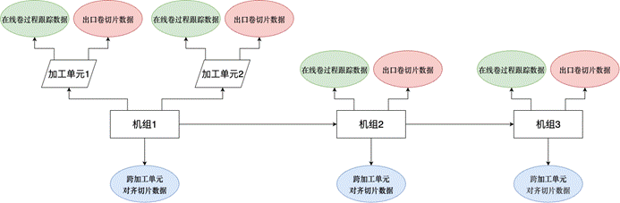

#### 2.2.3切片跟踪存在的场景

##### 2.2.3.1机组流转

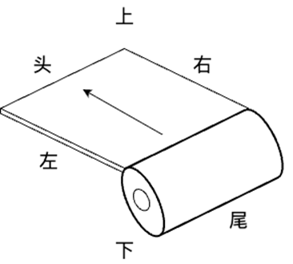

图中头表示开卷机上钢卷露在外，尾表示开卷机上钢卷藏在卷芯里。上表示朝钢卷外，下表示朝钢卷内。左表示带钢行进方向左边，右表示带钢行进方向右边。

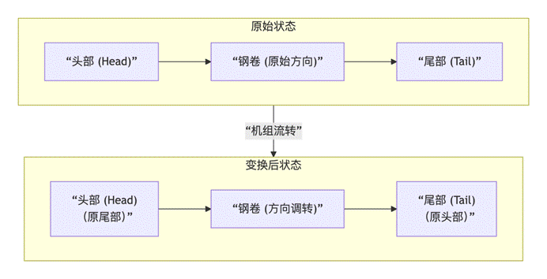

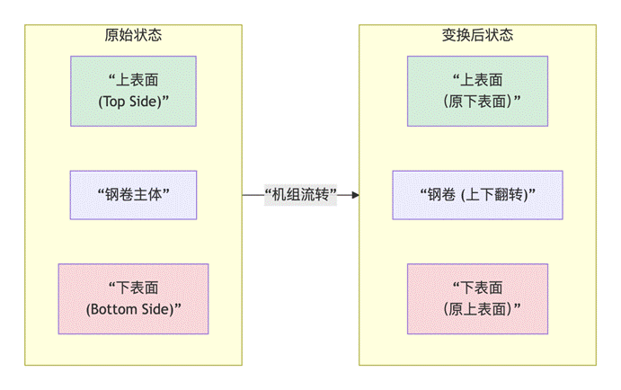

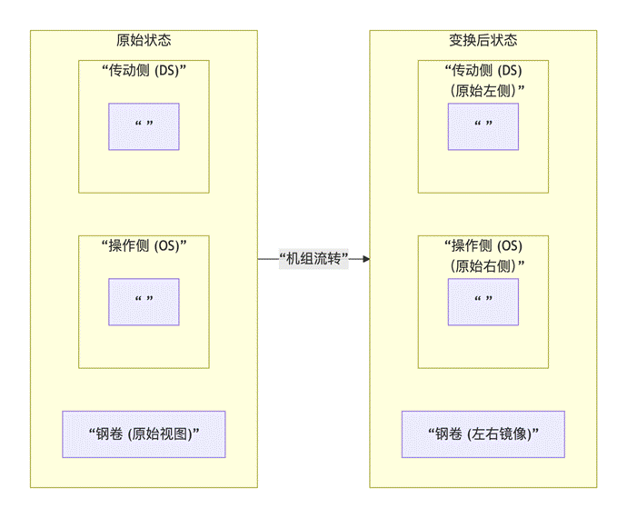

在数据结构中，基于钢卷坐标系，记录钢卷的头尾、左右及上下与坐标系的相互关系。用0表示相符，1表示相反。

##### 2.2.3.2长度剪切（含分卷）

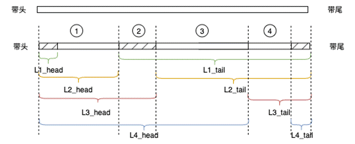

记录基于加工单元的切头/切尾量。

分卷时，切头/切尾量表示原料卷剔除成品卷的头尾余料长度。

其中，对于②进一步讨论：是否需要记录？切废的带钢是否重新赋予钢卷号？中间切废，除了返修回去给小机组处理，在下道机组处理吗？处理的话在哪里切？

不分卷时，钢卷在加工单元进行切头切尾。

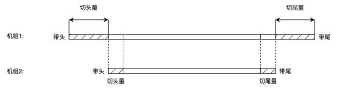

当实际切除长度与切片长度不一致时，将切片余料直接关联到对应切片。

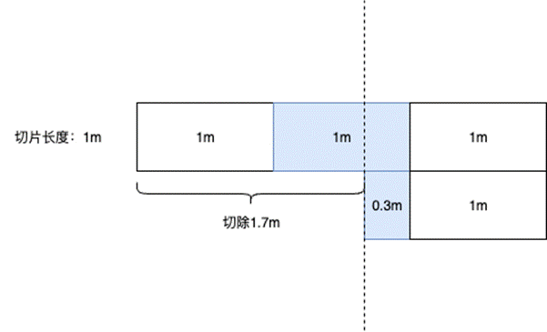

##### 2.2.3.3并卷

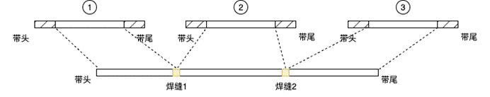

记录入口物料在出口物料的开始位置和结束位置。

##### 2.2.3.4边部剪切

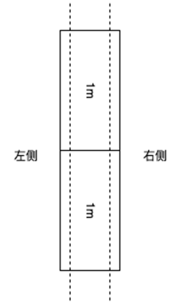

记录左侧/右侧切边量。

##### 2.2.3.5延伸

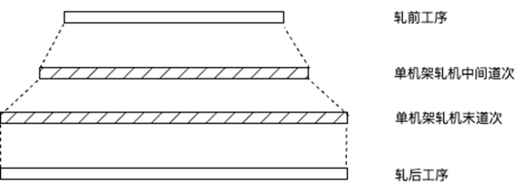

热轧卷是冷轧生产的原料。热轧提供的三种跟踪数据形式（待进一步讨论）：[[1]](#_msocom_1)

1.时序数据

2.带长数据

3.等长切片数据

在冷轧工序内部，讨论如何确定切片精度时，分为以下三种方案：

**方案一：**

若在原始卷阶段即可可靠获取厚度比值，以满足轧机末道次前所有机组切片长度在延伸后与轧机末道次后切片长度相等。但实际生产中，厚度比值需经轧机轧制后才能最终确定，因此该方案不具备可行性。

**方案二：**

精度设定：轧前机组统一采用0.1米的切片精度，轧后机组统一采用1米的切片精度。

数据聚合规则：当轧后一个切片对应轧前多个切片时自动计算轧前这多个切片相关数据的平均值，并将该聚合值作为与轧后切片匹配的数据。

该方案因聚合计算会引入显著误差，故不具备可行性。

**方案三：**

末道次前所有机组划片：采用经验值进行初步切片。该经验值的设定依据：厚度比值的最小值。

末道次重计算：在末道次完成后，以1米长度切片，同时基于实际的厚度比值，重新对前机组进行切片，保证前机组的新切片延伸后长度达到1米。

**方案四：**

步骤一：实时存储在线卷的原始时序数据到在线卷过程跟踪数据

步骤二：钢卷下线后，采用经验值进行切片，存储到出口卷等长切片数据

步骤三：钢卷下线后，以1米长度切片，基于实际的厚度比值，根据钢卷血缘关系表和所有前机组的在线卷过程跟踪数据，重新对所有机组进行切片，若有多个加工单元情况，取最后一个加工单元的在线卷过程跟踪数据，将对齐后所有机组切片数据存储到跨机组对齐切片数据。同时删除该钢卷在前机组存储的对齐切片数据，仅保留最新机组的对齐切片数据组。

#### 2.2.4数据存储结构

**关系表****-****机组配置表**

| 字段名 | 含义 | 备注 |
| --- | --- | --- |
|   | 机组代码 |   |
|   | 机组名称 |   |
|   | 机组顺序号 |   |
|   | 开卷机/卷取机是否在同侧 | 0否1是 |
|   |   |   |

**关系表****-****加工单元配置表**

| 字段名 | 含义 | 备注 |
| --- | --- | --- |
|   | 机组代码 |   |
|   | 加工单元代码 |   |
|   | 在线卷过程跟踪数据表 |   |
|   | **出口**卷等长切片数据表 |   |
|   | 切片长度 |   |
|   | 加工单元顺序号 |   |
|   |   |   |
|   |   |   |
|   |   |   |

**关系表****-****检测设备位置或区间配置表**

| 字段名 | 含义 | 备注 |
| --- | --- | --- |
|   | 机组代码 |   |
|   | 加工单元代码 |   |
|   | 检测设备代码 |   |
|   | 检测设备名称 |   |
|   | 焊缝检测仪序号 | 通常指最近的焊缝检测仪 |
|   | 起点距焊缝检测仪距离 |   |
|   | 终点距焊缝检测仪距离 |   |
|   | 正反面位置 |   |
|   | 检测设备顺序号 |   |
|   |   |   |
|   |   |   |

**关系表****-****检测参数配置表**

| 字段名 | 含义 | 备注 |
| --- | --- | --- |
|   | 检测设备代码 |   |
|   | 参数代码 |   |
|   | 参数名称 |   |
|   | 数据类型 |   |
|   | 参数顺序号 |   |

**时序表****-****在线卷过程跟踪数据表**

| 字段名 | 含义 | 备注 |
| --- | --- | --- |
| ts | 时间戳 |   |
|   | 入口物料跟踪号 |   |
|   | 入口物料生产次数号 |   |
|   | 加工单元代码 |   |
| length | 带头长度 |   |
|   | 活套1套量 |   |
|   | 活套套量2 |   |
|   | 活套套量3 |   |
| tag1 | 工艺参数1 |   |
| tag2 | 工艺参数2 |   |
| ... | ... |   |
| tag200 | 工艺参数200 |   |

**时序表****-****出口卷切片表**

| 字段名 | 含义 | 备注 |
| --- | --- | --- |
| ts | 时间戳 |   |
|   | 出口物料跟踪号 |   |
|   | 出口物料生产次数号 |   |
|   | 加工单元代码 |   |
| piece_no | 切片序号 |   |
| tag1 | 工艺参数1 |   |
| tag2 | 工艺参数2 |   |
| ... | ... |   |
| tag200 | 工艺参数200 |   |
| defect_groups | 缺陷关联组 | 关联数字钢卷缺陷映射表ID组 |
|   |   |   |

**关系表****-****跨加工单元对齐切片表**

底层API接口：

入参：开始加工单元、结束加工单元、物料跟踪号、生产次数号、参数组、结束加工单元切片长度、

出参：

存储结构有了API接口后再定。

存储机组内所有加工单元对齐切片数据。

| 字段名 | 含义 | 备注 |
| --- | --- | --- |
|   | 物料跟踪号 |   |
|   | 生产次数号 |   |
|   | 出口卷切片序号 |   |
|   | 原始卷切片序号 |   |
|   | 工艺参数组 | 结构树：工艺参数名、工艺参数值 |
|   | 缺陷关联组 | 关联数字钢卷缺陷映射表ID组 |
|   | 对齐切片组 -物料跟踪号 -生产次数号 -切片长度（对应该机组） -出口卷切片序号 -原始卷切片序号 -工艺参数组 -缺陷关联组 | 前加工单元各对应一组数据 |
|   |   |   |
|   |   |   |
|   |   |   |
|   |   |   |
|   |   |   |
|   |   |   |
|   |   |   |
|   |   |   |

存储结构1

| 字段名 | 含义 | 备注 |
| --- | --- | --- |
|   | 物料跟踪号 |   |
|   | 生产次数号 |   |
|   | 加工单元代码 |   |
|   | 出口卷切片序号 |   |
|   | 工艺参数组 | 结构树：工艺参数名、工艺参数值； |
|   | 缺陷关联组 | 关联数字钢卷缺陷映射表ID组； |
|   | 物料跟踪号 | 对齐机组1 |
|   | 生产次数号 |   |
|   | 加工单元代码 |   |
|   | 工艺参数组 |   |
|   | 缺陷关联组 |   |
|   | 物料跟踪号 | 对齐机组2 |
|   | 生产次数号 |   |
|   | 工艺参数组 |   |
|   | 缺陷关联组 |   |
|   |   | 对齐机组3 |
|   |   | 对齐机组4 |
|   |   | 对齐机组5 |
|   |   | 对齐机组6 |
|   |   | 对齐机组10 |
|   |   |   |
|   |   |   |
|   |   |   |
|   |   |   |
|   |   |   |

存储结构2

| 字段名 | 含义 | 备注 |
| --- | --- | --- |
|   | 对齐标识码 | 流水号 |
|   | 加工单元代码 |   |
|   | 物料跟踪号 |   |
|   | 生产次数号 |   |
|   | 切片长度 | 对应本机组 |
|   | 出口卷切片序号 |   |
|   | 原始卷切片序号 |   |
|   | 工艺参数组 | 结构树：工艺参数名、工艺参数值；不继承前机组数据 |
|   | 缺陷关联组 | 关联数字钢卷缺陷映射表ID组；不继承前机组数据 |
|   | 机组代码 | 冗余 |
|   |   |   |

**关系表****-****表检缺陷转数字钢卷缺陷映射表**

| 字段名 | 含义 | 备注 |
| --- | --- | --- |
|   |   |   |
| defect_id | 原始缺陷ID |   |
|   | 出口物料跟踪号 |   |
|   |   |   |
|   | 出口物料生产次数号 |   |
|   | 加工单元代码 |   |
| class_id | 缺陷类别 |   |
| class_name | 缺陷中文名称 |   |
| surface_original | 缺陷上下表面 | 在线卷相对于出口卷转换 |
| width | 缺陷宽度 |   |
| height | 缺陷长度 |   |
| x_pos_left_near_original | 缺陷宽度方向距左边最近距离 |   |
| x_pos_left_far_original | 缺陷宽度方向距左边最远距离 |   |
| y_pos | 缺陷长度方向距带头的距离 |   |
|   | 检测设备代码 | 缺陷来源 |
|   |   |   |

**关系表****-****并卷情况下入口和出口物料映射表**

| 字段名 | 含义 | 备注 |
| --- | --- | --- |
| **out_mat_track_no** | **出口物料跟踪号** |   |
| **out_mat_unit_prod_no** | **出口物料****生产次数号** |   |
|   | **物料顺序号** |   |
|   | 入口物料在出口物料的开始位置 |   |
|   | 入口物料在出口物料的结束位置 |   |
|   | 带头焊缝标识码 | 标识码规则：带尾钢卷号_流水号； |
|   | 带尾焊缝标识码 |   |
|   |   |   |
|   |   |   |

**关系表****-****焊接工艺数据表**

| 字段名 | 含义 | 备注 |
| --- | --- | --- |
| welder_id | 焊缝标识码 |   |
| head_coil_no | 带头物料号 | 后一卷钢；冗余 |
| tail_coil_no | 带尾物料号 | 前一卷钢；冗余 |
| current | 焊接电流 |   |
| pressure | 焊接压力 |   |
| power | 退火功率 |   |
| temperature | 焊接温度 |   |
| speed | 焊接速度 |   |
| qcds | QCDS质量评价 |   |
| reweld_number | 重焊次数 |   |

#### 2.2.4遗留问题

1.孔洞的数据结构。

2.焊机焊接过程中是不是叫前行钢卷号和后行钢卷号？

**答复：**叫做带头（后一卷钢），带尾（前一卷钢），以焊机作为分界线。

3.焊缝废料是否等于前废料与后废料之和,还有个设定值设置时机的问题。

**答复：**焊缝废料与前后废料没有关系。剪切前读取设定值。

4.重复生产、半卷回退的处理流程，钢卷号怎么流转？

**答复：**

重复生产：

不分卷：原料卷号不变。举例：A -> B，原料卷号用A，成品卷号用B。

分卷：原料卷号会变，按照分卷规则。举例：A -> A1, A -> A2，原料卷号用A1和A2。

半卷回退：

原料卷号不变，生成一个回退号（按照分卷规则），发给三级。再次生产的时候，下发回退号当作原料卷号。

举例：A -> A1，原料卷号用A1。

### 2.3数字钢卷 –剪切信号处理及钢卷坐标变换

| **剪刀种类** | **数据来源** | **场景** |
| --- | --- | --- |
| 入口剪 | 1.开卷机原料卷号 2.卷取机原料卷号 3.入口剪到开卷机光栅占位信号 4.开卷机剩余钢卷长度 5.剪切长度设定值 6.切尾量经验值 7.最大分切切废量经验值 | **切头：** 开卷机原料卷号≠卷取机原料卷号&&入口剪到开卷机光栅连续占位 **切尾：** 1.开卷机原料卷号=卷取机原料卷号&&开卷机剩余钢卷长度<切尾量经验值 2.开卷机原料卷号=卷取机原料卷号&&开卷机剩余钢卷长度<切尾量经验值 **分切： **开卷机原料卷号=卷取机原料卷号&&开卷机剩余钢卷长度>=切尾量经验值 |
| 出口剪 | 1.开卷机原料卷号 2.卷取机原料卷号 3.出口剪到卷取机光栅占位信号 4.剪切长度设定值 5.最大分切切废量经验值 | **切头：** 开卷机原料卷号≠卷取机原料卷号&&出口剪到卷取机光栅非连续占位 **切尾：** 开卷机原料卷号≠卷取机原料卷号&&出口剪到卷取机光栅连续占位 **分切：** 开卷机原料卷号=卷取机原料卷号 |
| 入口双层剪 | 1.开卷机钢卷颜色 2.卷取机钢卷颜色 3.剪刀靠近开卷机侧颜色 4.开卷机剩余钢卷长度 5.剪切长度设定值 6.切尾量经验值 7.最大分切切废量经验值 | **切头：** 开卷机钢卷颜色≠卷取机钢卷颜色&&剪刀靠近开卷机侧颜色=开卷机钢卷颜色 **切尾：** 1.开卷机钢卷颜色=卷取机钢卷颜色&&开卷机剩余钢卷长度<=切尾量经验值 2.开卷机钢卷颜色≠卷取机钢卷颜色&&剪刀靠近开卷机侧颜色≠开卷机钢卷颜色 **分切：** 开卷机钢卷颜色=卷取机钢卷颜色&&开卷机剩余钢卷长度>切尾量经验值 |
| 出口飞剪 | 1.卷取机处颜色 2.活套处颜色 3.后取样片数 4.后废料片数 5.焊缝废料片数 6.单片剪切长度 7.最大分切切废量经验值 | **切焊缝：**既切头又切尾 **分切：**卷取机处颜色=活套处颜色 |
| 圆盘剪 | 1.开卷机钢卷宽 2.圆盘剪设定宽度 | **边部剪切** |

#### 2.3.1信号类型

##### 2.3.1.1非连续处理线入口剪触发信号

**切头：**开卷机原料卷号≠卷取机原料卷号&&入口剪到开卷机光栅连续占位

**记录数据：**开卷机原料卷切头量+=入口剪剪切长度设定值

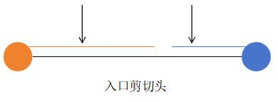

**切尾：**

1.开卷机原料卷号=卷取机原料卷号&&开卷机剩余钢卷长度<切尾量经验值

**记录数据：**卷取机原料卷号切尾量+=入口剪剪切长度设定值

2.开卷机原料卷号≠卷取机原料卷号&&入口剪到开卷机光栅不连续占位

**记录数据：**卷取机原料卷切尾量+=入口剪剪切长度设定值

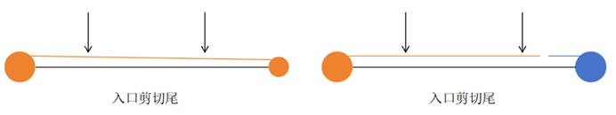

**分切：**开卷机原料卷号=卷取机原料卷号&&开卷机剩余钢卷长度>=切尾量经验值

**记录数据：**半卷回退。

1、记录原始原料卷号的切头量、切尾量，以及每个子卷后的切废量，切废量记为原料卷号#1切废、原料卷号#2切废、原料卷号#3切废

2、识别到分切信号时，查询当前原料卷的#切废最大值，原料卷#MAX切废

2.1若未查询到，则生成原料卷号#1，其切废量=0，其开卷机剩余长度=当前开卷机剩余长度

2.2若查询到，则判断 原料卷#MAX切废的开卷机剩余长度-当前开卷机剩余长度<=最大切废量

2.2.1若判断结果为真，则说明该信号为上一次分切行为中的切废。原料卷#MAX切废的切废量+=出口剪剪切长度设定值

2.2.2若判断结果为假，则说明该信号为下一次分切行为。生成原料卷#MAX+1切废，其切废量=0，其开卷机剩余长度=当前开卷机剩余长度

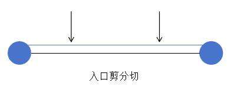

##### 2.3.1.2非连续处理线出口剪触发信号

**切头：**开卷机原料卷号≠卷取机原料卷号&&出口剪到卷取机光栅非连续占位

**记录数据：**开卷机原料卷切头量+=出口剪剪切长度设定值

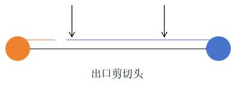

**切尾：**开卷机原料卷号≠卷取机原料卷号&&出口剪到卷取机光栅连续占位

**记录数据：**卷取机原料卷号切尾量+=出口剪剪切长度设定值

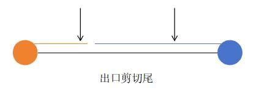

**分切：**开卷机原料卷号=卷取机原料卷号

记录数据：

1.记录原始原料卷号的切头量、切尾量，以及每个子卷后的切废量，切废量记为原料卷号#1切废、原料卷号#2切废、原料卷号#3切废

2.识别到分切信号时，查询当前原料卷的#切废最大值，原料卷#MAX切废

2.1若未查询到，则生成原料卷号#1，其切废量=0，其开卷机剩余长度=当前开卷机剩余长度

2.2若查询到，则判断 原料卷#MAX切废的开卷机剩余长度-当前开卷机剩余长度<=最大切废量

2.2.1若判断结果为真，则说明该信号为上一次分切行为中的切废。原料卷#MAX切废的切废量+=出口剪剪切长度设定值.

2.2.2若判断结果为假，则说明该信号为下一次分切行为。生成原料卷#MAX+1切废，其切废量=0，其开卷机剩余长度=当前开卷机剩余长度

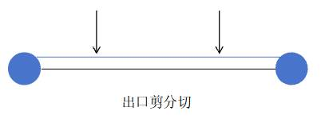

##### 2.3.1.3连续处理线入口双层剪触发信号

**切头：**开卷机钢卷颜色≠卷取机钢卷颜色&&剪刀靠近开卷机侧颜色=开卷机钢卷颜色

**记录数据：**根据开卷机钢卷颜色获取原料卷号，该原料卷号切头量+=入口剪剪切长度设定值

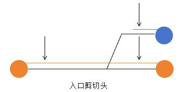

**切尾：**

1.开卷机钢卷颜色=卷取机钢卷颜色&&开卷机剩余钢卷长度<=切尾量经验值

**记录数据：**根据卷取机钢卷颜色获取原料卷号，该原料卷号切尾量+=入口剪剪切长度设定值

2.开卷机钢卷颜色≠卷取机钢卷颜色&&剪刀靠近开卷机侧颜色≠开卷机钢卷颜色

**记录数据：**根据卷取机钢卷颜色获取原料卷号，该原料卷号切尾量+=入口剪剪切长度设定值

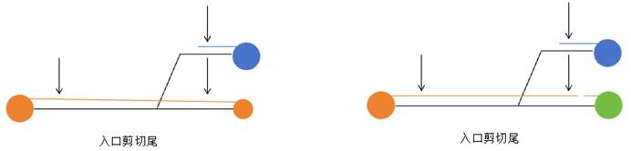

**分切：**开卷机钢卷颜色=卷取机钢卷颜色&&开卷机剩余钢卷长度>切尾量经验值

**记录数据：**半卷回退。

1、记录原始原料卷号的切头量、切尾量，以及每个子卷后的切废量，切废量记为原料卷号#1切废、原料卷号#2切废、原料卷号#3切废

2、识别到分切信号时，查询当前原料卷的#切废最大值，原料卷#MAX切废

2.1若未查询到，则生成原料卷号#1，其切废量=0，其开卷机剩余长度=当前开卷机剩余长度

2.2若查询到，则判断 原料卷#MAX切废的开卷机剩余长度-当前开卷机剩余长度<=最大切废量

2.2.1若判断结果为真，则说明该信号为上一次分切行为中的切废。原料卷#MAX切废的切废量+=出口剪剪切长度设定值

2.2.2若判断结果为假，则说明该信号为下一次分切行为。生成原料卷#MAX+1切废，其切废量=0，其开卷机剩余长度=当前开卷机剩余长度

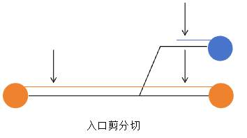

##### 2.3.1.4连续处理线飞剪触发信号

**切焊缝：**既切头又切尾

**记录数据：**取活套处颜色号对应原料卷号，切头量=（后取样片数+后废料片数+焊缝废料片数/2）x单片剪切长度；取卷取机处颜色号对应原料卷号，切尾量=（前取样片数+前废料片数+焊缝废料片数/2）x单片剪切长度

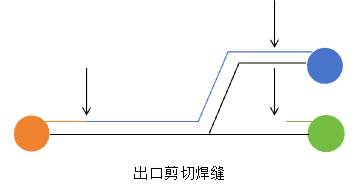

**分切：**卷取机处颜色=活套处颜色

**记录数据：**

1、记录原始原料卷号的切头量、切尾量，以及每个子卷后的切废量，切废量记为原料卷号#1切废、原料卷号#2切废、原料卷号#3切废

2、识别到分切信号时，查询当前原料卷的#切废最大值，原料卷#MAX切废

2.1若未查询到，则生成原料卷号#1，其切废量=0，其开卷机剩余长度=当前开卷机剩余长度

2.2若查询到，则判断 原料卷#MAX切废的开卷机剩余长度-当前开卷机剩余长度<=最大切废量

2.2.1若判断结果为真，则说明该信号为上一次分切行为中的切废。原料卷#MAX切废的切废量+=飞剪剪切长度设定值

2.2.2若判断结果为假，则说明该信号为下一次分切行为。生成原料卷#MAX+1切废，其切废量=0，其开卷机剩余长度=当前开卷机剩余长度

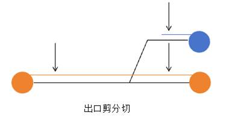

##### 2.3.1.5圆盘剪信号

**边部剪切**

**记录数据：**切边量=（开卷机钢卷宽度-圆盘剪设定宽度）/2

#### 2.3.2钢卷坐标位置变化及数据存储结构

**钢卷坐标系定义：**对于任意一个钢卷，经过翻转后，使其带头出现在钢卷的最上方，定义其带头朝外的一侧为头，卷在钢卷内部的一侧为尾，带头的上表面为上，带头的下表面为下，带头的左侧为左，右侧为右。

**钢卷过程数据坐标系定义：**运行中的带钢，最先从开卷机中开出来的为头部，最后从开卷机中出来的为尾部，运行中的带钢的上表面为上，下表面为下，带钢运行方向的左侧为左，右侧为右

**工序内部钢卷坐标变化情况：**工序内部坐标变化情况，0表示一致，1表示不一致

**表一：加工单元****过程数据相对加工单元入口卷的坐标变化**

| 开卷方式 | 上下 | 左右 | 头尾 |
| --- | --- | --- | --- |
| 上开卷 | 0 | 0 | 0 |
| 下开卷 | 1 | 1 | 0 |
| 直通 | 0 | 0 | 0 |

**表二：加工单元出口卷****相对****加工单元****过程数据的坐标变化**

| 卷取方式 | 上下 | 左右 | 头尾 |
| --- | --- | --- | --- |
| 上卷取 | 0 | 1 | 1 |
| 下卷取 | 1 | 0 | 1 |
| 直通 | 0 | 0 | 0 |

**表三：****加工单元出口卷****相对****加工单元入口卷****的坐标变化（由表一表二叠加得到）**

| 开卷方式 | 卷取方式 | 是否同侧 | 上下 | 左右 | 头尾 |
| --- | --- | --- | --- | --- | --- |
| 上开卷 | 上卷取 | 是 | 0 | 1 | 1 |
| 上开卷 | 下卷取 | 是 | 1 | 0 | 1 |
| 下开卷 | 上卷取 | 是 | 1 | 0 | 1 |
| 下开卷 | 下卷取 | 是 | 0 | 1 | 1 |
| 上开卷 | 直通 | 是 | 0 | 0 | 0 |
| 下开卷 | 直通 | 是 | 1 | 1 | 0 |
| 直通 | 上卷取 | 是 | 0 | 1 | 1 |
| 直通 | 下卷取 | 是 | 1 | 0 | 1 |
| 上开卷 | 上卷取 | 否 | 1 | 1 | 1 |
| 上开卷 | 下卷取 | 否 | 0 | 0 | 1 |
| 下开卷 | 上卷取 | 否 | 0 | 0 | 1 |
| 下开卷 | 下卷取 | 否 | 1 | 1 | 1 |
| 上开卷 | 直通 | 否 | 1 | 0 | 0 |
| 下开卷 | 直通 | 否 | 0 | 1 | 0 |
| 直通 | 上卷取 | 否 | 1 | 1 | 1 |
| 直通 | 下卷取 | 否 | 0 | 0 | 1 |

以下开卷，上卷取为例：

1.已知，钢卷过程数据：上表面，距离头1m，距离左侧6m处有瑕疵

2.由钢卷过程数据根据表一可推得，原料钢卷：下表面，距离头1m，距离右侧6m处有瑕疵

3.由钢卷过程数据根据表二可推得，成品数字钢卷：上表面，距离尾1m，距离右侧6m处有瑕疵

若计算某工序的成品数字钢卷相对于首工序的原料卷（进冷轧厂的原始卷）的坐标变化，需要将某工序及之前所有工序的表三结果进行叠加

### 2.4工作计划

| 事项 | 说明 | 状态 | 工期 | 开始时间 | 结束时间 |
| --- | --- | --- | --- | --- | --- |
| 物料数据模拟 | 1.主物料档表/机组间和机组内物料血缘表创建和模拟数据，含剪切、分卷、并卷、延伸所有情况。 2.基于已有时序数据，匹配物料号。 3.切头尾量/切边量/开卷卷曲方式数据自行模拟。 3.pg数据库创建表和数据。 | 完成 | 5d | xxxx/xx/xx |   |
| 多维度平台树配置 | 1.机组/加工单元/检测设备/检测参数配置 2.基于已有时序数据，匹配检测参数 | 完成 | 3d |   |   |
| 表检数据模拟 |   | 未开始 | 1d |   |   |
| 在线卷过程跟踪数据整理 | 基于已有时序数据整理 | 完成 | 2d |   |   |
| 出口卷切片划片 | 加工单元内切片划片 缓存多维度平台数据到redis；提供元数据接口； | 完成 | 3d ->7d |   |   |
| 跨加工单元对齐切片数据 | 1.给定任意开始加工单元和结束加工单元，在线跨中间所有加工加工单元对齐切片，含所有变换情况 2.封装数据返回接口 | 进行中 | 7d |   |   |
| 接口测试 | 测试报告 | 进行中 | 2d |   |   |
|   |   |   |   |   |   |
|   |   |   |   |   |   |
|   |   |   |   |   |   |
|   |   |   |   |   |   |
|   |   |   |   |   |   |
|   |   |   |   |   |   |
|   |   |   |   |   |   |
|   |   |   |   |   |   |
|   |   |   |   |   |   |

### 2.6问题

1.多维度平台树配置节点属性时，扩展属性只支持2个，需支持多个。沟通过后回复有优化这个功能点的计划，同时静态数据功能可替代。

2.涟钢现场TD的时序数据怎么和多维度平台上配置匹配上？有没有成熟且简单的方案？自行通过代码去连接数据库，然后查询数据。

沟通回复的方案：

a.新部署一套多维度平台，配置文件关联已有TD时序库，且仅支持一个库名，所以需要把所有用到的表复制到同一个库中

b.多维度平台消息那里绑定已有的数据表，然后里面点位绑定已有的数据表列

c.只要普通列，tag列不要

3.多维度平台提供创建时序表接口、写入时序数据表接口。

[[1]](#_msoanchor_1)待进一步讨论
