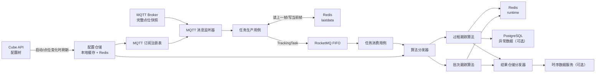
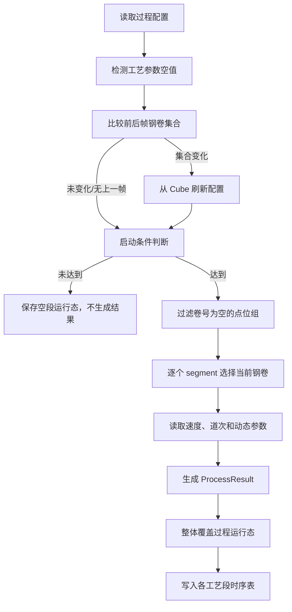
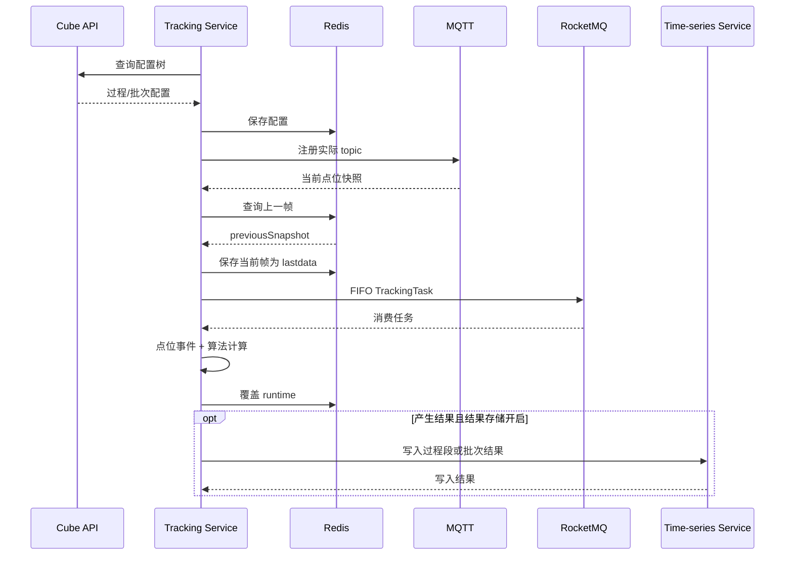

# 跟踪服务项目代码全景说明

> 本文依据当前仓库代码整理，描述实际已经落地的架构、数据流、过程跟踪算法、批次跟踪算法、配置与存储方式。文中所说的“当前实现”均以 `src/main` 下代码为准，而不是早期设计稿。

## 1. 项目定位与实现范围

本项目是按机组独立部署的数字钢卷跟踪服务。服务从 Cube API 获取跟踪配置，按配置订阅 MQTT 点位快照，将当前帧和上一帧封装成 RocketMQ FIFO 任务，执行领域算法后把运行态保存到 Redis，并可将算法结果写入时序数据服务、将异常点位写入 PostgreSQL。

当前技术基线：

- Java 8、Spring Boot 2.7.6、Spring Cloud 2021.0.5；
- MQTT：Spring Integration MQTT；
- 消息队列：RocketMQ 5.x FIFO 消息；
- 缓存与运行态：Redis；
- 配置来源：Cube API；
- 结果存储：时序数据存储服务（OpenFeign）；
- 异常存储：PostgreSQL、MyBatis-Plus。

`TrackingType` 定义了 `PROCESS`、`BATCH`、`SHEAR`、`UNCOILER`、`WELDING`、`TRIMMING` 六种类型，但当前完整接入配置、算法、运行态和结果仓储的只有：

| 类型 | 编码 | 当前状态 |
| --- | --- | --- |
| 过程跟踪 | `process` | 已实现 |
| 批次跟踪 | `batch` | 已实现 |
| 剪切、开卷、焊接、切边 | `shear` 等 | 只有枚举定义，未接入当前算法链路 |

`TrackingConfigController`、`ReTrackingController` 目前只有空的请求路径定义；`ConfigController`、`AbnormalController` 以及重跟踪、配置刷新、异常查询用例也是空壳。因此当前没有可用的配置刷新、重跟踪或异常查询 HTTP API，配置初始化依赖应用启动，配置变化也可由点位事件触发。

## 2. 总体架构

项目按分层和端口适配思想组织：

```text
com.wisdri.tracking
├─ controller                 HTTP 入口（当前多数为占位）
├─ application/usecase       应用流程编排
│  ├─ runner                 启动入口
│  └─ tracking               订阅、生产任务、消费任务
├─ domain
│  ├─ model                  配置、快照、任务、结果、运行态、异常模型
│  ├─ repository             Redis/时序库/PostgreSQL 的领域端口
│  └─ service                算法、点位事件、异常检测及其分发器
├─ infrastructure
│  ├─ dto                    MQTT、Feign、PostgreSQL DTO
│  ├─ properties             外部配置映射
│  ├─ repository             领域仓储的技术实现
│  └─ service                MQTT、RocketMQ、Redis、Feign、PostgreSQL 适配器
└─ common                    响应、异常、JSON 工具
```

核心设计是“按跟踪类型分发”：

- `TrackingAlgorithmDispatcher` 选择对应的领域算法；
- `PointEventHandlerDispatcher` 选择对应的点位事件处理器；
- `TrackingRuntimeRepositoryDispatcher` 选择配置和运行态仓储；
- `TrackingResultRepositoryDispatcher` 选择结果表及写入实现；
- `AbnormalDataHandlerDispatcher` 选择异常检测器。

新增一种跟踪类型时，应同时补齐配置模型、Cube 转换器、算法、点位事件处理器、运行态模型和结果仓储，而不只是增加枚举值。

## 3. 端到端数据流



### 3.1 启动与配置初始化

1. `TrackingApplication` 启动 Spring Boot。
2. `TrackingRunner.run()` 调用 `PointSubscriptionUseCase.start()`。
3. `TrackingRuntimeRepositoryDispatcher.refreshConfig()` 调用 Cube API 的 `POST /openapi/meta/tree`，根路径默认为 `/aygg_tracking`。
4. Cube 配置树按跟踪类型转换成 `ProcessTrackingConfig` 或 `BatchTrackingConfig`。
5. 配置以 JSON 写入 Redis，再反序列化到 JVM 本地 `ConcurrentMap` 缓存。
6. 若开启结果存储，则按配置调用时序服务创建或更新结果表。
7. 应用遍历全部 `TrackingType`，但只会找到当前仓储实际支持且 Cube 返回的 `PROCESS`、`BATCH` 配置，并注册其 MQTT topic。

配置刷新时，如果本地已经存在配置对象，仓储通过 `BeanUtils.copyProperties` 就地更新原对象，以保持已注册订阅上下文中的配置引用有效。

### 3.2 MQTT 消息进入任务队列

1. `MqttMessageListener` 从消息头提取 topic，将 `byte[]` 或其他 payload 统一转换为 UTF-8 字符串。
2. `TrackingTaskProducerUseCase` 用 topic 在 `MqttSubscriptionRegistry` 中反查机组、跟踪类型、配置和可选模板编码。
3. payload 必须是 JSON object，解析为 `Map<String, Object>`；浮点数保留为 `BigDecimal`，随后封装成 `PointSnapshot` 并记录 `receivedAt`。
4. 再次检查配置存在且 `enable=true`。未注册 topic、缺少配置或禁用配置都不会产生任务。
5. 从 Redis 读取同一“机组 + 类型 + 模板”的上一帧快照。
6. 组装 `TrackingTask`：当前帧、上一帧、机组、类型、模板编码和发布时间。
7. 先把当前帧写入 Redis 作为下一帧的上一帧，再同步发送 RocketMQ FIFO 消息。

需要注意：当前代码的顺序是“保存当前快照，再发送 MQ”。如果 MQ 同步发送最终失败，Redis 里的上一帧仍已前移，后续消息不会再以失败消息之前的快照作为 previous。

### 3.3 RocketMQ 顺序与消费

- destination：`{topic}:{unitCode}`，机组代码同时作为 Tag；
- 普通过程跟踪 order key：`{unitCode}:{trackingType}`；
- 模板化批次跟踪 order key：`{unitCode}:{trackingType}:{templateCode}`。

因此同一机组、同一类型、同一模板实例内保持 FIFO，不同批次模板可以并行。

消费者把消息反序列化成 `TrackingTask`，交由 `TrackingTaskConsumerUseCase`：

1. `TrackingInput.of(task)` 转成算法输入；
2. 算法分发器按类型执行；
3. 无结果时直接结束，但算法运行态仍可能已经更新；
4. 有结果时由结果仓储分发器写时序服务；
5. 反序列化、算法或结果存储发生未处理异常时，消费者返回 `FAILURE`，交由 RocketMQ 重试。

## 4. 配置流转与缓存模型

### 4.1 Cube API 到领域配置

Cube API 返回树形元数据，转换器负责把它组装成算法配置：

- 过程跟踪：根目录 `data.default` 提供基础配置，`tech` 子目录生成 `segments`，直属点位生成各段 `points`；
- 批次跟踪：`data.default` 提供模板和段定义，再遍历每个模板目录校验各段点位结构一致，并补充动态参数点位；
- Cube `valueType` 转换为 `PointDataType`；缺省类型按 `float` 处理；
- JSON 使用 snake_case，并兼容大小写不敏感枚举和单值转数组。

批次配置中的 `tracking.point` 和 `segments[].point` 特意使用单数 JSON 字段，Java 模型内仍是 `List`。

### 4.2 Redis Key

所有 key 会转成小写：

| 用途 | 非模板 key | 模板化 key |
| --- | --- | --- |
| 配置 | `tracking:{unit}:{type}:config` | 配置按类型共享，不按模板拆分 |
| 上一帧 | `tracking:{unit}:{type}:lastdata` | `tracking:{unit}:{type}:{template}:lastdata` |
| 算法运行态 | `tracking:{unit}:{type}:runtime` | `tracking:{unit}:{type}:{template}:runtime` |

批次运行态必须携带 `templateCode`，防止不同炉台共享状态。

### 4.3 配置、快照和运行态的区别

| 数据 | 作用 | 生命周期/更新时机 |
| --- | --- | --- |
| `TrackingConfig` | 决定订阅、点位路径和算法参数 | 启动及钢卷集合变化时从 Cube 刷新 |
| `PointSnapshot` | 一次 MQTT 完整点位快照 | 每条有效消息都覆盖 Redis 上一帧 |
| `TrackingRuntime` | 当前算法计算摘要，便于观察或恢复 | 每次算法执行结束时整体覆盖 |
| `TrackingResult` | 对外存储的历史结果 | 达到算法条件且选中钢卷时写时序库 |

运行态不是算法下一次计算的主要输入；当前算法主要使用任务携带的当前/上一帧和当前配置。过程运行态保存速度、启动条件和各段卷号/带头长度，批次运行态保存生产状态和南北侧卷号。

## 5. 公共点位读取规则

`PointReader` 通过 `pointPrefix + point.name` 形成完整路径，并从快照 map 读取值：

- 数值统一转换为 `BigDecimal`；
- 布尔值兼容布尔类型和常见数值表达，供轧制方向判断；
- 动态参数保留原始值；
- 过程算法判定卷号是否为空时使用 `trim()`；
- 批次算法会额外清理首尾空白、控制字符、Unicode 空格和格式字符（包括常见零宽字符）。

点位 payload 被视为一帧完整快照，不做跨帧字段合并。

## 6. 过程跟踪算法

入口为 `ProcessTrackingAlgorithmImpl.calculate()`，一帧最多为每个配置工艺段生成一条 `ProcessResult`。

### 6.1 处理顺序



算法先持有本地缓存配置对象，再触发点位事件；配置刷新会就地复制到该对象，所以刷新后的字段可以在本轮后续计算中生效。

### 6.2 前置条件

1. 配置必须存在，当前快照和 `tracking` 必须存在；
2. 若未配置 `startCondition`，视为直接通过；
3. 若配置了启动条件，则读取：

   `actual = latest[tracking.pointPrefix + startCondition.point.name]`

   仅当 `actual != null`、阈值不为空且 `actual >= threshold` 时继续；
4. 从 `tracking.points` 中去除卷号为空或全空白的点位组。

### 6.3 带头长度与选卷规则

对每个 `segment` 独立选卷。统一定义：

`correctedLength = rawLength + segment.lengthCorrect`

当 `lengthCorrect` 为空时按 `0` 处理。

#### WELDER（焊缝模式）

- 长度下标取 `segment.lengthArrayIndex`，为空时为 `0`；
- 每个候选组读取 `group.length[index]`；
- 过滤缺少该下标、长度为空或 `correctedLength < 0` 的组；
- 在剩余组中选择 `correctedLength` 最小者。

可理解为选择已经到达该段、且带头距离最接近该段的钢卷。

#### COILER（卷取机模式）

- 固定读取 `group.length[0]`；
- 过滤长度点缺失、长度值为空以及 `correctedLength < lengthCorrect` 的组；
- 因为 `correctedLength = rawLength + lengthCorrect`，上述门槛等价于 `rawLength >= 0`；
- 在剩余组中选择 `correctedLength` 最大者。

#### ROLLING（轧机模式）

先按方向筛候选组，再复用 COILER 选卷规则：

`targetRollingCoiler = direct XOR directReverse`

- `direct` 来自 `rolling.directPoint`；未配置或无法读为 true 时按 false；
- 只保留 `group.isRollingCoiler == targetRollingCoiler` 的组；
- 然后固定读取 `length[0]`，选择修正长度最大者；
- 道次号来自 `rolling.passNoPoint`，以 `BigDecimal.intValue()` 转成整数。非 ROLLING 模式道次号为空。

### 6.4 过程结果

每个成功选卷的段生成：

| 字段 | 来源 |
| --- | --- |
| `unitCode`、`trackingType` | 当前配置 |
| `segmentCode`、`segmentName` | 当前段配置 |
| `coilNo` | 被选中点位组的卷号点 |
| `headLength` | 被选中组的修正后长度 |
| `speed` | `tracking.speedPoint` |
| `passNo` | 仅轧机模式的道次点 |
| `parameters` | `segment.points` 对应原始值，空值不写入 map |
| `receivedAt` | MQTT 快照接收时间 |
| `generatedAt` | 结果生成时间 |

无论本帧是否产生结果，算法都会整体覆盖 `ProcessTrackingRuntime`。因此未达到启动条件或未选中任何段时，运行态的 `segments` 会被清空，而速度值和启动条件值仍尽可能保存。

## 7. 批次跟踪算法

批次跟踪面向模板化设备，例如 `fb1` 至 `fb36`。一份 `BatchTrackingConfig` 会在注册阶段展开成多个实际 MQTT topic，每条消息只处理一个 `templateCode`。

### 7.1 模板展开

配置示例：

```json
{
  "template": {
    "code": "fb{index}",
    "index_from": 1,
    "index_to": 36
  },
  "mqtt_topic": "baf1_batch_tracking_{template}"
}
```

会展开 `fb1` 至 `fb36`，对应 topic `baf1_batch_tracking_fb1` 至 `baf1_batch_tracking_fb36`。模板编码必须包含 `{index}`，topic 必须包含 `{template}`，且起始序号不能大于终止序号。

### 7.2 处理步骤

1. 输入类型必须是 `BATCH`，且 `templateCode` 不能为空；
2. 读取批次配置并执行批次点位事件处理；
3. 将路径中的 `{template}` 替换为当前模板编码；
4. 读取生产状态 `productionStatus`，格式错误或缺失均视为 null；
5. 根据 `tracking.point[].segment` 读取并清洗 `north`、`south` 卷号；
6. 当 `productionStatus >= startCondition.threshold` 时，按固定顺序处理 `north`、`south`；
7. 某侧卷号为空或缺少该侧段配置时，只跳过该侧；
8. 每帧都覆盖该模板的 `BatchTrackingRuntime`，即使未达到生产条件或卷号未变化。

当前 `BatchPointEventHandler` 的实际行为是：存在上一帧且前后帧卷号集合不同时刷新全局配置；首帧不触发刷新。算法类中“卷号变化不会触发配置刷新”的旧注释与处理器实际代码不一致，应以处理器行为为准。

### 7.3 参数合并

每侧结果的动态参数按以下顺序合并：

1. 先写 `common` 段参数；
2. 再写当前 `north` 或 `south` 段参数；
3. 同名参数由当前侧覆盖公共值；
4. 值为 null 的参数不进入结果。

批次结果包含机组、类型、模板编码、侧别编码/名称、卷号、生产状态、动态参数、接收时间和生成时间。当前模型虽然继承了通用结果结构，但批次算法不会计算 `headLength`、`speed`、`passNo`。

## 8. 异常检测与步骤日志

### 8.1 异常检测

当前只实现过程跟踪的空数据检测：遍历每个过程段的参数点位，原始值为 null 或空字符串时生成 `NULL_DATA` 异常。

- `tracking.storage.abnormal.enabled=false` 时不写 PostgreSQL；
- 开启后批量写入 `abnormal_data` 表；
- 异常保存失败只记录错误日志，不中断主算法；
- 当前未实现异常波动检测，也未实现批次异常检测；
- `AbnormalController` 和查询用例尚为空，因此仓储虽有查询方法，目前没有 HTTP 查询入口。

### 8.2 算法步骤日志

`TrackingStepLogger` 使用独立的 `tracking.step` logger 输出单行 JSON，包含机组、类型、模板、快照时间、阶段、工艺段和详情。主要阶段包括：

- 计算开始/完成；
- 启动或生产条件检查；
- 钢卷分组筛选；
- 轧制方向判断；
- 区段候选钢卷评估；
- 区段结果生成或跳过；
- 钢卷集合检查。

日志序列化失败会降级记录 warning，不影响算法计算。

## 9. 结果存储

过程和批次结果存储分别受 `tracking.storage.process.enabled`、`tracking.storage.batch.enabled` 控制，默认关闭。开启后，配置刷新时先建表/更新表，消费时再写数据。

### 9.1 过程跟踪时序表

- 每个工艺段一张表；
- 表名：`{unitCode}_{trackingTypeCode}_{segmentCode}`，例如 `CP1_process_nof`；
- 固定列：`coil_no`、`head_length`、`speed`、`pass_no`；
- 段参数点位转为动态列；
- 数据时间戳使用 MQTT 快照 `receivedAt`，并标记为设备时间。

### 9.2 批次跟踪时序表

- 同一机组所有模板和南北侧共用一张表；
- 表名统一小写：`{unit}_batch`，例如 `baf1_batch`；
- `fb_code` 取模板编码中的数字部分；
- `segment_code`：south = `0`，north = `1`；
- 公共、北侧、南侧动态列合并建表，同名列类型必须一致，否则抛出异常；
- south 使用原始 `receivedAt`，north 增加 `1ms`，避免同帧两条记录因相同主时间戳互相覆盖。

批次建表固定列中包含 `head_length`、`speed`、`pass_no`，但当前写入请求只实际写 `fb_code`、`segment_code`、`coil_no`、`prod_status` 和动态参数。

### 9.3 外部调用重试

时序服务的建表和写入使用相同的同步重试策略：最多尝试 3 次，初始退避 200ms，每次翻倍，上限 2000ms。三次失败后抛出 `ExternalServiceException`，最终令本条 RocketMQ 消费返回失败。

当前代码没有实现早期设计稿所述的本地后台重试队列或“失败 10 次写 Redis”。

## 10. 配置项与运行依赖

关键配置：

| 配置 | 说明 |
| --- | --- |
| `tracking.unit` | 当前实例负责的机组，默认示例为 `cp1` |
| `tracking.storage.abnormal.enabled` | 是否保存异常数据 |
| `tracking.storage.process.enabled` | 是否创建并写入过程跟踪时序结果表 |
| `tracking.storage.batch.enabled` | 是否创建并写入批次跟踪时序结果表 |
| `mqtt.*` | Broker、客户端、QoS、重连等 |
| `rocketmq.producer.*` | 生产 topic、端点、超时和尝试次数 |
| `rocketmq.push-consumer.*` | 消费 topic、机组 Tag、消费组和端点 |
| `cube-api.*` | 配置中心地址、树根和超时 |
| `time-series-storage.*` | 时序服务地址、数据库和超时 |
| `spring.datasource.*` | PostgreSQL 连接 |
| `spring.redis.*` | Redis 连接 |

本地启动：

```bash
mvn spring-boot:run -Plocal
```

仓库 POM 当前未定义名为 `local` 的 Maven profile；实际生效的是 `application.yaml` 中的 `spring.profiles.active: local`。如果 Maven 报告 profile 不存在，可使用 `mvn spring-boot:run`，或显式传入 Spring profile。启动前需保证所选 profile 中的 PostgreSQL、Redis、MQTT、RocketMQ、Cube API 和时序服务可达。部署环境的账号、密码和地址不应复制到本文或提交到新的公共配置中。

## 11. 关键时序



## 12. 扩展与维护建议

### 12.1 新增过程段或参数

通常只需修改 Cube 配置树：增加段配置、点位前缀和点位元数据。配置刷新后会重建/更新时序表规则。应保证 `segment.code` 稳定，因为它同时参与结果标识和表名。

### 12.2 新增跟踪类型

至少需要完成以下闭环：

1. `TrackingType` 枚举；
2. 专用 `TrackingConfig` 和 Cube 转换器；
3. `TrackingRuntime` 及仓储类型注册；
4. `TrackingAlgorithm` 实现；
5. 必要的 `PointEventHandler`、`AbnormalDataDetector`；
6. `TrackingResult` 和结果仓储；
7. MQTT 订阅规则、测试与示例配置。

### 12.3 当前实现中的关注点

- 快照先落 Redis 再发送 MQ，发送失败时 previous 语义会前移；
- 配置变化不会重新清理已经注册的旧 topic，注册表当前只做添加/覆盖；
- 结果存储为同步外部调用，会直接拉长单条 MQ 消费时间；
- 过程卷号只做普通 `trim()`，批次卷号才做完整不可见字符清理；
- Cube 配置刷新、重跟踪和异常查询尚无可用 HTTP 入口；
- 批次算法注释与批次点位事件处理器在“卷号变化是否刷新配置”上不一致；
- profile 配置中可能包含环境凭据，后续应迁移到环境变量或密钥管理系统。

## 13. 代码导航

| 主题 | 主要代码 |
| --- | --- |
| 启动编排 | `application/usecase/runner/TrackingRunner.java` |
| MQTT 订阅与入口 | `infrastructure/service/mqtt/` |
| 任务生产/消费编排 | `application/usecase/tracking/` |
| RocketMQ 适配 | `infrastructure/service/rocketmq/` |
| 过程算法 | `domain/service/tracking/impl/ProcessTrackingAlgorithmImpl.java` |
| 批次算法 | `domain/service/tracking/impl/BatchTrackingAlgorithmImpl.java` |
| 点位事件 | `domain/service/point/impl/` |
| 配置与运行态 Redis 仓储 | `infrastructure/repository/runtime/TrackingRuntimeRepositoryImpl.java` |
| 上一帧 Redis 仓储 | `infrastructure/repository/point/LastPointSnapshotRepositoryImpl.java` |
| Cube 配置转换 | `infrastructure/service/feign/converter/` |
| 时序结果仓储 | `infrastructure/repository/tracking/` |
| 异常检测与存储 | `domain/service/abnormal/`、`infrastructure/repository/abnormal/` |
| 示例配置 | `docs/config/` |
| 算法回归测试 | `src/test/java/com/wisdri/tracking/domain/service/tracking/impl/` |

## 14. 验证命令

```bash
# 全量单元测试
mvn clean test

# 两套核心算法测试
mvn test -Dtest=ProcessTrackingAlgorithmImplTest,BatchTrackingAlgorithmImplTest

# 打包
mvn clean package
```
